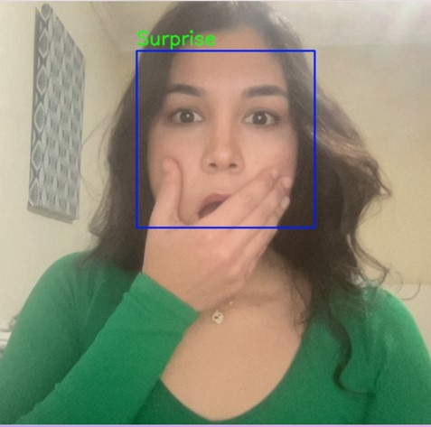
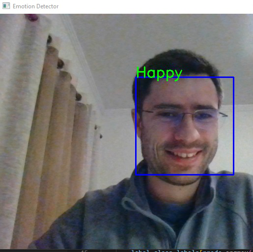
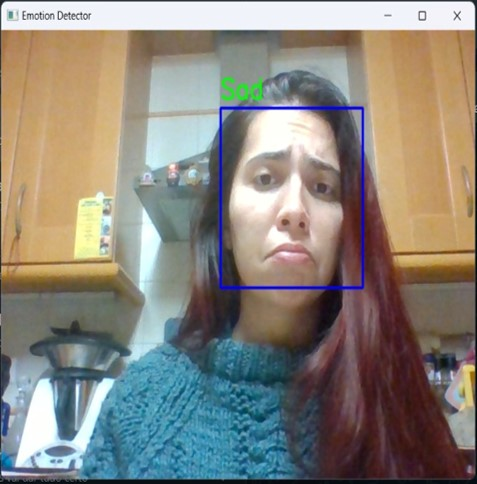
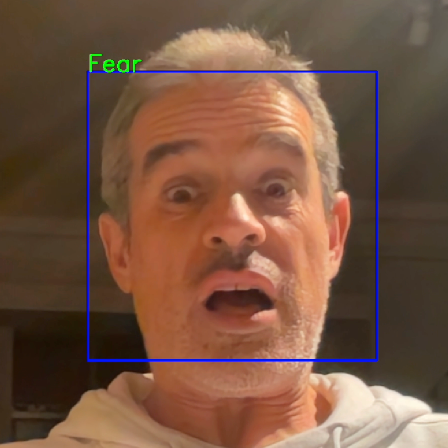

# DLNN - Deep Learning Neural Networks - Group 9

DLNN project for the Deep Learning Neural Networks course of the 2022 Postgraduate Program in Enterprise Data Science & Analytics of NOVA IMS

<center>
<p>





</p>

<table width="90%">
    <tr style="border-collapse: collapse; border: none;">
        <td style="text-align: center; vertical-align: middle; border-collapse: collapse; border: none;">Adryelle Rios - 20211053</td>
        <td style="text-align: center; vertical-align: middle; border-collapse: collapse; border: none;">David Carmo - 20211042</td>
        <td style="text-align: center; vertical-align: middle; border-collapse: collapse; border: none;">Marta La Feria - 20211051</td>
        <td style="text-align: center; vertical-align: middle; border-collapse: collapse; border: none;">Nuno Felicio - 2021823</td>
        <td style="text-align: center; vertical-align: middle; border-collapse: collapse; border: none;">Pedro Assis - 20211368</td>
    </tr>
</table>
</center>

<!-- TOC -->

- [DLNN - Deep Learning Neural Networks - Group 9](#dlnn---deep-learning-neural-networks---group-9)
  - [To run our project you need to do the following steps](#to-run-our-project-you-need-to-do-the-following-steps)
    - [To run with google\_colab](#to-run-with-google_colab)
    - [To run locally:](#to-run-locally)
    - [Install the following packages:](#install-the-following-packages)
  - [To run the applications:](#to-run-the-applications)
    - [Python application](#python-application)
    - [Google colab](#google-colab)
    - [Mobile Application](#mobile-application)
      - [Android](#android)
      - [iOS](#ios)
      - [Source Code](#source-code)
  - [Folder structure](#folder-structure)

<!-- /TOC -->


## To run our project you need to do the following steps

* Clone the repository
* Download the dataset from https://www.kaggle.com/datasets/jonathanoheix/face-expression-recognition-dataset

### To run with google_colab
    
* Upload the images folder to google drive in a zip file called `Faces.zip`
* Open the `emotions_detector.ipynb` and change the variable `import_files_from_google_colab` to `TRUE`
  
### To run locally:
* Open the `emotion_detector.ipynb` and double check that the variable `import_files_from_google_colab` is set to `FALSE`
* Unzip `Faces.zip` into the `input` folder

### Install the following packages:
* pandas (`conda install pandas`)
* seaborn (`conda install -c anaconda seaborn`)
* plotly (`conda install -c plotly plotly`)
* tensorflow (`pip install tensorflow`)
* keras (`conda install -c conda-forge keras`)

## To run the applications:

### Python application

[Video with application test](videos/python_app_test.mp4)

* Clone the repository
* Install the following packages:
    * tensorflow (`pip install tensorflow`)
    * openCV (`pip install opencv-python`)
* Run `python web_cam_application.py`
* Have fun trying multiple facial expressions and see which emotions are being classified by the model
* When you are done press "S" in the keyboard to stop the application


### Google colab

*


### Mobile Application

#### Android
* Upload the file [emotion_detector_app/emotion-detector.apk](emotion_detector_app/emotion-detector.apk) to your Android
* On your android enable the permission to install .apk from unknown sources ([more info](https://blog.appaloosa.io/en/guides/how-to-install-apps-from-unknown-sources-in-android))
* Run the `emotion-detector.apk` file on your Android to install the app.
* Run the app

#### iOS
* It is not possible to install/test the iOS version of the application because due to the restrictions imposed by Apple, it is necessary to have a (paid) iOS developer account in order to install the iOS application for a mobile phone or for the Apple Store.

#### Source Code

* The source code for the mobile application (Android and iOS) is on the [emotion_detector_app](emotion_detector_app) folder.
* The application is made with [Flutter](https://flutter.dev)
* To change, build and test the application, [Flutter](https://flutter.dev) must be installed (following the tutorials that exist on the website)
* To run the application, simple type `flutter run` (you must have a mobile device connected to the computer or a simulator)
* To build / run for iOS you must install [Flutter](https://flutter.dev) on a Mac computer.


## Folder structure

```
lib
│
│   README.md               
│
│   emotions_detector.ipynb         [main notebook]
│   google_colab_emotions_detector.ipynb         [Google colab app]
│   webcam_application.py           [Python Application]
|   model_converter_to_tflite.py    [Program to convert from tensorflow model to a tensorflow lite model]
│
├───images      [Folder with the group images]
├───videos      [sample videos of the applications running]
├───models      [Folder with the model files] 
├───emotion_detector_app      [mobile application source code and apk] 
│               
├───input      [Folder where the dataset must be downloaded]
